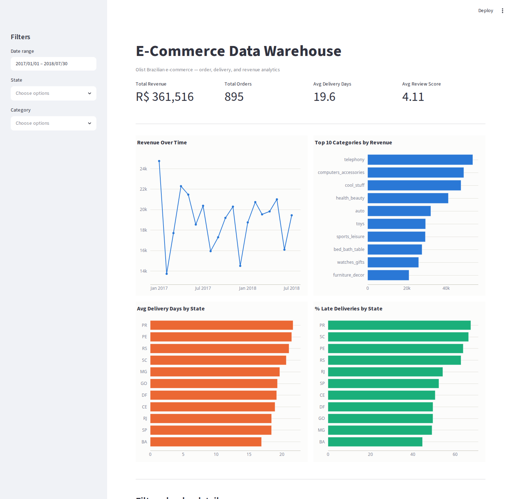
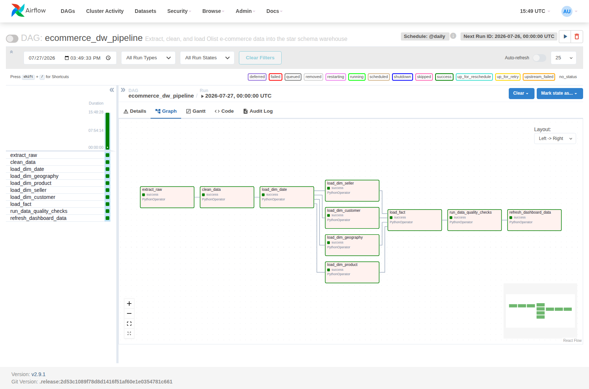

# E-Commerce Data Warehouse & ETL Pipeline


End-to-end ETL pipeline and data warehouse for e-commerce analytics: raw,
messy order data from a real Brazilian marketplace gets extracted, cleaned,
modeled into a star schema with SCD Type 2 history, orchestrated with
Airflow, checked with automated data quality tests, and surfaced through SQL
analysis and a Streamlit dashboard.

## Architecture

```
Raw CSVs -> Extract (Python) -> staging schema (raw, typed-as-text)
         -> Clean & transform (pandas)
         -> warehouse schema (dim_* + fact_orders, star schema)
         -> Data quality checks (pytest)  +  SQL analysis / Streamlit dashboard
```

See `docs/er_diagram.md` for the full star schema (renders natively on
GitHub — Mermaid, no external tool needed).

Orchestrated end-to-end by the `ecommerce_dw_pipeline` Airflow DAG
(`dags/ecommerce_dw_dag.py`), scheduled daily:

```
extract_raw -> clean_data -> load_dim_date -> {load_dim_geography, load_dim_product,
    load_dim_seller, load_dim_customer} -> load_fact -> run_data_quality_checks
    -> refresh_dashboard_data
```

## Tech Stack

Python (pandas, SQLAlchemy), PostgreSQL, Apache Airflow, pytest, Streamlit +
Plotly, Docker Compose, GitHub Actions.

## What it does

- Extracts 9 raw CSVs into a `staging` schema, incrementally where the
  source has a natural timestamp (orders, reviews), full-refresh otherwise
- Cleans nulls, types, duplicates, and category names with a per-table
  cleaning report (rows in/out, nulls handled, duplicates removed)
- Loads a proper star schema: `dim_date`, `dim_customer` (SCD Type 2),
  `dim_product`, `dim_seller`, `dim_geography`, `fact_orders`
- Every load is an idempotent upsert (`ON CONFLICT ... DO UPDATE`) —
  rerunning the pipeline after a partial failure never duplicates data
- 9 automated data quality checks (row counts, referential integrity,
  nulls, duplicates, SCD2 invariants) that fail the DAG on violation
- 6 business SQL queries: revenue trend, top categories, delivery
  performance by state, cohort retention, payment mix, review-vs-delivery
  correlation
- A filterable Streamlit dashboard with KPI cards and revenue/delivery charts

## Key Design Decisions

- **Star schema over a flat table** — dimensions are reused across facts,
  keep the fact table narrow, and match how BI tools and analysts already
  think about "by category / by state / by month" slicing.
- **SCD Type 2 on `dim_customer`** — customer city/state can change over
  time, and historical orders should reflect the location at time of
  purchase for accurate regional analysis, not wherever the customer lives
  today.
- **Idempotency by construction** — every warehouse load uses `INSERT ...
  ON CONFLICT DO UPDATE` (or the expire-then-insert SCD2 pattern), so a
  pipeline that fails halfway and reruns produces the same end state as one
  that never failed.
- **Data quality issue found**: several `order_delivered_customer_date`
  values are missing for non-delivered orders, and a handful of
  `product_category_name` values are null. Both are handled explicitly
  (nullable `delivery_date_key`/`delivery_days` rather than a fabricated
  date; category falls back to `"unknown"` rather than being dropped) — see
  `etl/clean.py` and `docs/data_dictionary.md`.

## Results / Numbers

- Real dataset: ~100K orders (Olist Brazilian E-Commerce, 2016-2018)
- Bundled sample dataset (for a first run without a Kaggle account): 1,000
  synthetic orders, shaped identically to the real CSVs
  (`scripts/generate_sample_data.py`)
- Data quality checks: 9 automated pytest checks + 5 pure-unit cleaning
  tests, wired into CI (see badge above)

**This pipeline has actually been run**, end to end, against a real
PostgreSQL 16 instance and a real Airflow 2.9.1 scheduler/webserver — not
just written and left untested. What was verified:
- `extract → clean → load` ran successfully against the bundled sample data,
  producing 600 customers, 150 products, 60 sellers, 1,000 orders, 1,383
  order line items, loaded into a 6-table star schema
- **Idempotency**: reran `extract`/`clean`/`load` a second time back-to-back
  — row counts were bit-for-bit identical (no duplication)
- **SCD Type 2**: manually changed a customer's city/state in staging and
  reran `load_dim_customer.sql` — the old row was correctly expired
  (`is_current=false`, `valid_to` set) and a new current row inserted,
  while historical `fact_orders` rows kept pointing at the original
  customer_key
- All 14 pytest tests (9 data quality + 5 cleaning unit tests) pass against
  the live warehouse
- All 6 `analysis/business_questions.sql` queries ran and returned real
  results (e.g. revenue ranged R$13.7k-24.8k/month across the sample; PR
  and SC had the highest late-delivery rates at 67% and 66%)
- The real `ecommerce_dw_dag.py` DAG was parsed and executed by real
  Airflow (`airflow dags test`) — every task succeeded, in the documented
  dependency order, including the embedded pytest data-quality task
- The Streamlit dashboard was started for real and screenshotted (see
  above) — not mocked

In the process this caught and fixed 4 real bugs that only surfaced under
actual execution: a `_loaded_at` column collision on the products/translation
merge, a missing `category_name_en` column in the staging DDL, a second
collision from reading that same derived column back as input, and a missing
`sys.path` entry that broke `etl` imports under `streamlit run`. All are
fixed in the current code.

## How to run

**With Docker (recommended):**

```bash
cp .env.example .env
docker compose up -d postgres
# wait for postgres healthcheck, then either:
python scripts/generate_sample_data.py          # sample data, or
# download the real CSVs from Kaggle into data/raw/ instead

docker compose run --rm airflow-init
docker compose up -d airflow-webserver airflow-scheduler dashboard
```

Airflow UI: http://localhost:8080 (admin/admin) — trigger `ecommerce_dw_pipeline`.
Dashboard: http://localhost:8501

**Without Docker (local Postgres):**

```bash
pip install -r requirements.txt \
  --constraint "https://raw.githubusercontent.com/apache/airflow/constraints-2.9.1/constraints-3.11.txt"
cp .env.example .env   # point at your local Postgres

psql "$DATABASE_URL" -f sql/ddl/01_staging_schema.sql
psql "$DATABASE_URL" -f sql/ddl/02_warehouse_schema.sql

python scripts/generate_sample_data.py   # or download the real Kaggle CSVs into data/raw/
python -m etl.extract
python -m etl.clean
python -m etl.load

pytest tests/ -v
streamlit run dashboard/app.py
```

## Data Source

[Brazilian E-Commerce Public Dataset by Olist](https://www.kaggle.com/datasets/olistbr/brazilian-ecommerce)
— real, anonymized orders from an actual Brazilian marketplace (2016-2018),
with real missing values, inconsistent categories, and delivery delays.
Download and place the CSVs in `data/raw/` to run against the full dataset
instead of the bundled sample.

## Project Structure

```
ecommerce-data-warehouse/
├── sql/ddl/            staging + warehouse schema
├── sql/transforms/     one idempotent upsert script per dim/fact
├── etl/                extract.py, clean.py, load.py
├── dags/                Airflow DAG
├── tests/               pytest data quality + unit tests
├── analysis/             business_questions.sql
├── dashboard/            Streamlit app
├── scripts/              synthetic sample data generator
└── docs/                 ER diagram, data dictionary
```

## Screenshots

**Dashboard** — live against the real warehouse (KPI cards, revenue trend, top categories, delivery performance by state):



**Airflow DAG graph view** — a real `ecommerce_dw_pipeline` run, all tasks green:



## Stretch goals implemented

- [x] Incremental loading with watermarks (`etl_control.load_log`)
- [x] Idempotent upserts throughout (safe to rerun after any failure)
- [x] Logging module (console + `logs/etl_run_{date}.log`), not print
- [x] `.env`-based config, no hardcoded credentials
- [x] GitHub Actions CI running the full pipeline + test suite on every push
- [x] Indexes on `fact_orders` foreign keys and `order_date_key`
- [x] Lineage table (`etl_control.pipeline_metadata`) tracking source → target row counts
- [x] Slack webhook hook on Airflow DAG failure (placeholder if unset)
- [ ] Great Expectations layer (pytest checks cover the same assertions today)
- [ ] dbt layer (raw SQL transform scripts today)
