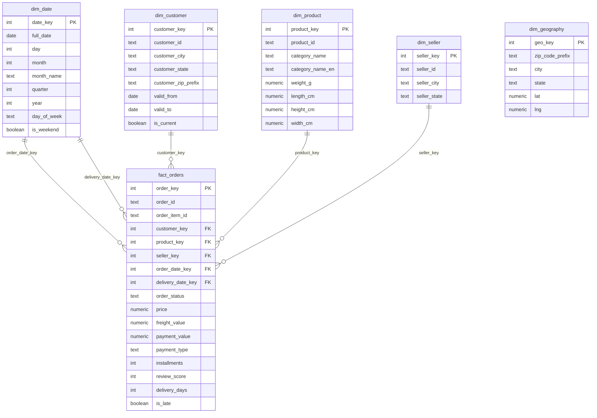

# ER Diagram

GitHub renders this Mermaid diagram natively — no external tool needed to view it.
For a PNG (e.g. to embed in a slide deck), paste the DDL from `sql/ddl/02_warehouse_schema.sql`
into [dbdiagram.io](https://dbdiagram.io) or run this file through the [Mermaid Live Editor](https://mermaid.live)
and export as `docs/er_diagram.png`.

